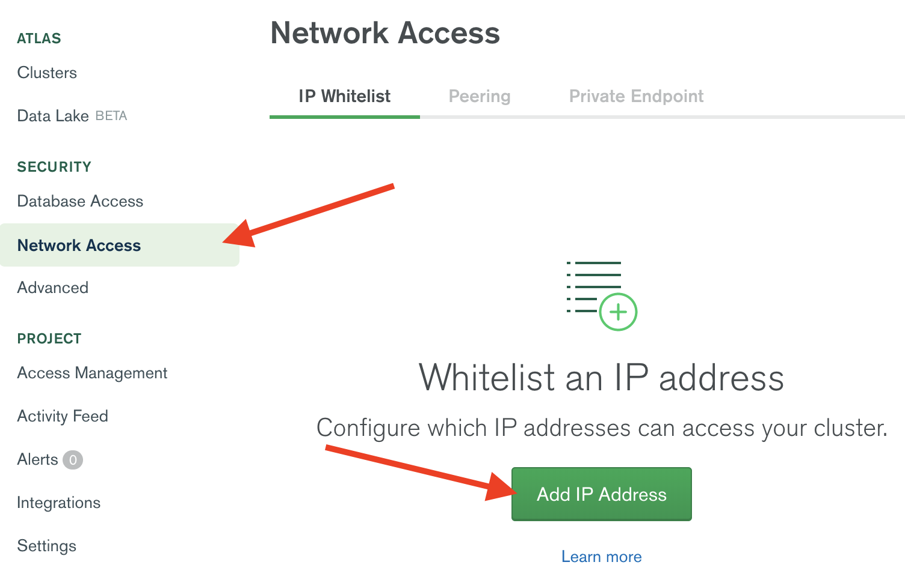
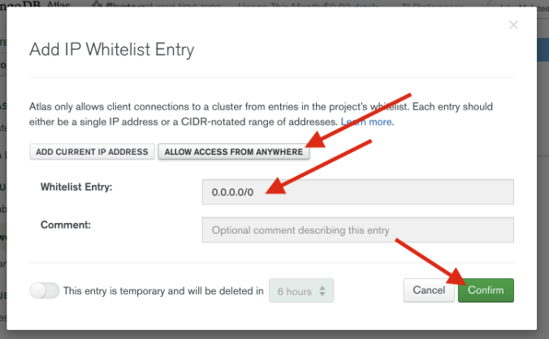

Return to the home of this repository [here](../readme.md).

# MongoDB Atlas Setup

* Create a free account on MongoDB Atlas at [cloud.mongodb.com](https://cloud.mongodb.com). Click on “Get Started Free”  if you do not have an account or “Sign In” if you already have a login. Then create your account/sign in as required.

> 

* Under the 'Starter Clusters' box (left-hand side), click 'Create a cluster'

> 

* Select AWS as the Cloud Provider and then Ireland as the region

>

* Confirm the the 'M0 Sandbox' Cluster Tier is selected, then click create cluster

>

* While this spins up, lets click on the “Database Access” submenu, under “Security” on the left menu, then 'Add New User'.

> 

* Enter a user name. For our demo, let’s enter `mdbadmin` and enter a secure password.  Record your user name and password in a safe location for reference later. Under “User Privileges”, select “Atlas admin” and click on the “Add User button to complete this section.

>

* Lets click on the “Network Access” submenu, under “Security” on the left menu. Click on “Add IP Address”.

>

* Select “Allow Access from Anywhere” for the purpose of this demo, select "Save as temporary whitelist" and click on “Confirm”.  

*Note*:  When running a cluster in production, you will want to narrow the scope of where your database can be accessed and specify a specific IP address/CIDR block and/or using VPC peered connection. For this demo we are creating a temporary whitelist entry which will automatically be removed after the specified period of time, preventing general access to the cluster.

>

* Go to “Clusters” submenu, under “Atlas” on the left menu, then click "..." for your cluster, select "Load Sample Dataset".

> 

Congratulations - you've set-up your first Atlas Cluster and loaded it with sample data! Time to move onto the next step - [set up your first Stitch application and configure GraphQL](./02-mongodb-stitch-graphql.md).