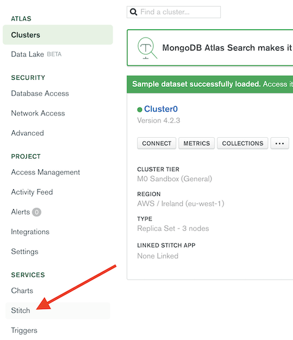
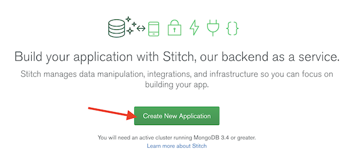
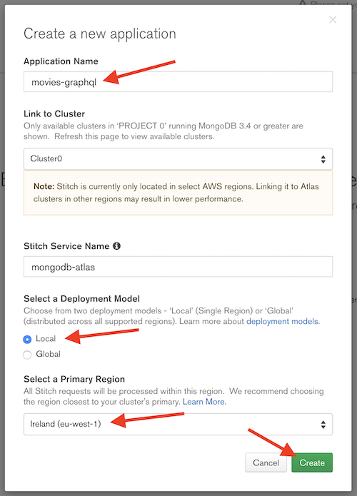
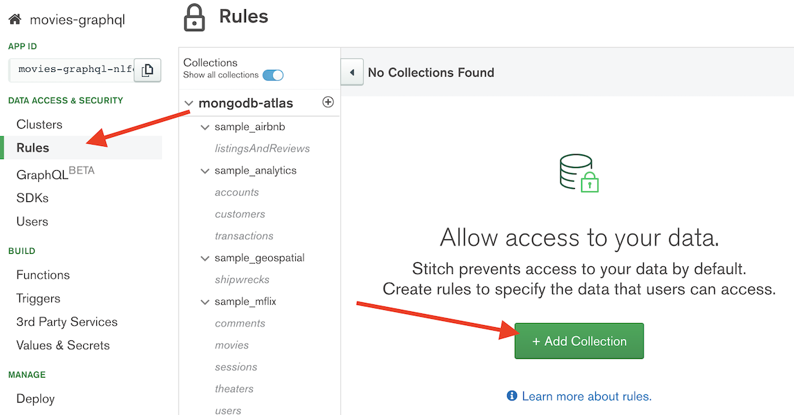
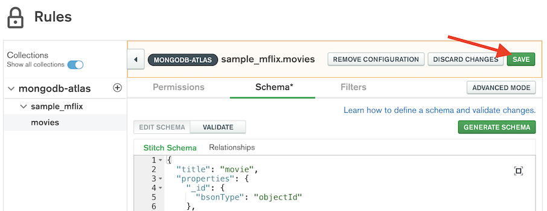

Return to the home of this repository [here](../readme.md).

# MongoDB Stitch Setup
Click Stitch in the left-hand navigation panel (under "Services)
> 

Click to create a new application
> 

Fill in the necessary fields to create the application, specifically;
* Application Name (you can chose, we used `movies-graphql`)
* Select 'Local' deployment (this just means the application will be deployed in a single cloud region)
* Select 'Ireland' (or whatever region you deployed your MongoDB Atlas cluster)
* Click 'Create'
> 

Once the application has been created, we need to enable anonymous access to it. This doesn't mean people can access your data without authentication, but it does mean that anyone can authenticate - so when chosing this option you should assume any data you're hosting will be available publicly.

Select `Users` in the left hand menu, then click through to the `Providers` tab and click to `Edit` the "Allow users to log in anonymously" provider. 
> 

Toggle the "Provider Enabled" option to `On` and click `Save`
> 

Next we need to define the default rules with which users can access the data. Click `Rules` in the left hand menu, then click `+ Add Collection`.
> 

Select the `sample_mflix` database and the `movies` collection. Then in the "Permissions Template" drop down, select `Users can only read all data`. This means that by default, all authenticated users will be able to read all data. 
> 

You'll notice a blue bar appear at the top of your window explaining that you have new changes that are yet to be deployed. Click `Review & Deploy Changes` then click `Deploy` in order to deploy the changes you've made.
> 

Nice! Now you've created your first stitch app and configured it to allow anonymous users to read all data. Next we'll configure the GraphQL endpoint. 

# GraphQL Configuration
The first thing we need to do is define a schema for GraphQL to use when reading the data. MongoDB Stitch can automatically generate a schema by sampling the dataset you loaded earlier. Click on the `Schema` tab, and then click `Generate Schema`.
> 

Click `Generate Schema`. Stitch will sample 1,000 documents from the movies collection in order to generate a GraphQL Schema.
> 

Next, click `Save` in order to save the schema you have generated. 
> 

The blue "Review and Deploy Changes" bar will appear again. Follow the steps from earlier to deploy the changes. 
> 

Nice! Now you have deployed your first GraphQL endpoint on MongoDB Stitch. Let's see if we can access data through the endpoint. 

MongoDB Stitch has a built in browser based GUI for accessing data through GraphQL, the UI is called Graph*i*QL. Click `GraphQL` in the left hand menu to access this interface.
> 

Scroll to the bottom of the left-hand pane and you'll see a query has been automatically generated based on the data. Click the Play button (triangle) to run the query.
> 

Notice also that MongoDB Stitch has also automatically generated documentation of the GraphQL endpoint on the right handside. This is interactive so you can click through to understand the different queries and data types available. 
> 

Feel free to run a few queries to get used to the way GraphQL is structured. Here's a few examples:

```json
query {
  movie {
	title
    year
    fullplot
  }
}
```
or to retrieve multiple movies, use this:
```json
query {
  movies {
	title
    year
    fullplot
  }
}
```
The queries you are running are available over the internet at the GraphQL Endpoint at the top of the page. 

**Congratulations** - you've created your first GraphQL endpoint on MongoDB Stitch!

As an optional step, if you were interested, you could use an API client like [Postman](https://www.postman.com/product/api-client) or [Insomnia](https://insomnia.rest/) to hit the same endpoints or of course call them directly from an application your building. Just make sure to get retrieve an access token first - see our docs [here](https://docs.mongodb.com/stitch/graphql/authenticate-graphql-requests/#get-a-client-api-access-token) for more details. 

Return back to the [home page](../readme.md) to proceed to the next step.