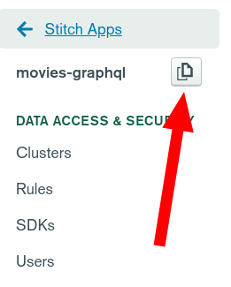
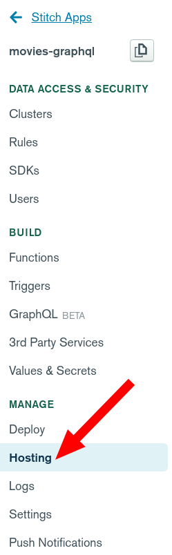
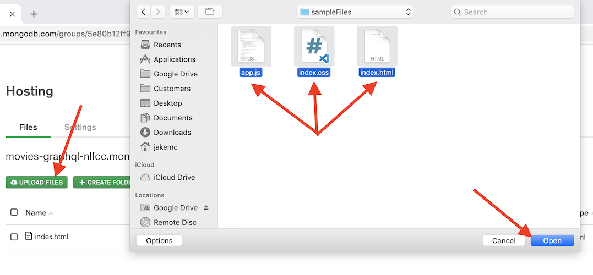
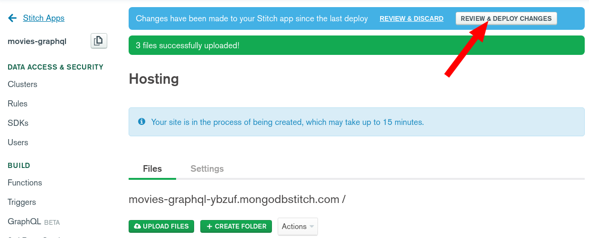
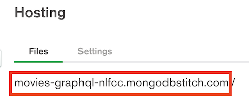
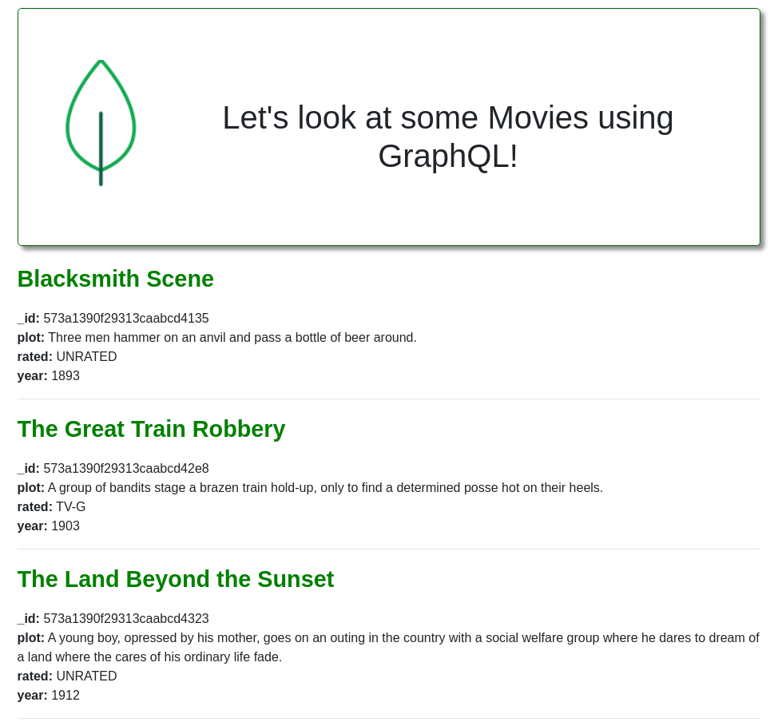

Return to the home of this repository [here](../readme.md).

# Explanation of Sample Files
In this section, we will deploy a simple web application to Stitch using the Stitch Hosting feature. The web application is made up of three files; `index.html`, `index.css` and `app.js`. The sample files are provided in the [sampleFiles folder](./sampleFiles). 


## index.html
This file ([index.html](../sampleFiles/index.html)) is a simple HTML website which imports a number of style scripts, JavaScript and a Font. It also creates the basic structure for our website. 

There are two critical lines in the file which I will explain a little further:

```html    
<p id="results" style="font-size: 1em"></p>
```

The `<p id="results"` creates a paragraph element within the webpage, and assigns it the id `results`. With this id, the element can be updated later using the JavaScript. 

```html    
<script src="./app.js"></script>
```

This imports/executes the `app.js` JavaScript file onto the page. 

## app.js
This file ([app.js](../sampleFiles/app.js)) is the JavaScript file which is referred to in the `index.html` file discussed above. It contains the JavaScript based logic used to retrieve data from the GraphQL endpoint and display it on the webpage. 

**Review the file in detail**, it is heavily commented to explain the application logic. It follows this rough flow:
1. Declare some basic variables
2. Call a getMovies function
3. Anonymously Authenticates with Stitch
4. Queries the GraphQL endpoint using the app_id and query defined in 1 and the Access Token retrieved in 3
5. Calls addToList for each movie returned by the end point
6. Generates formatted HTML for each movie and updates the web page to show it

## index.css
This file ([index.css](../sampleFiles/index.css)) is a simple style sheet which defines some styles which make the webpage look a little more pleasing to the eye. It doesn't functionally affect the web application - just the way it looks.

1. Introduce the sample files
2. Explain the HTML structure
3. Explain the Javascript structure
4. Update the Stitch IDs


# Updating and Hosting the Web Application
## Downloading and Extract the Sample Files
This repository has three sample files:
- [index.html](../sampleFiles/index.html)
- [app.js](../sampleFiles/app.js)
- [index.css](../sampleFiles/index.css)

You need to download each of these files, which can be achieved by either;
* Cloning this repository (if you're familiar with Git)
* Downloading and extracting a zip file hosted on Google Drive: [mongodb-graphql-lab-samplefiles.zip](https://drive.google.com/file/d/1CzKfHdR0rwH1PO8jHKppQhDMaLTHgJC-/view?usp=sharing) (the download button is in the top right)

## Updating your app_id
The app_id in the `app.js` file currently has a placeholder value, but this needs to be updated with your Stitch App ID in order to have it use the GraphQL endpoint you created earlier. 

Open your browser to MongoDB Stitch again, see in the top left hand area a box called `APP ID`. Copy this value.
> 

Now we need to add the ID to your JavaScript app. Open the `app.js` file using a text editor, and update the second line. It should look like this (but with your application id):
```javascript
const app_id = 'movies-graphql-sdfae';
```
***Note:** The id is a combination of the application name you defined earlier, and a unique string, so if you didn't use the applicatino name `movies-graphql` then that won't be part of your App ID.*

## Hosting your Web Application on Stitch
Now we need to host this web application on Stitch so that it's accesible over the internet. Return to Stitch in your browser and complete the following steps.

Navigate back to the Hosting section by clicking `Hosting` in the left hand navigation menu.

> 

Upload the three files (`index.html`, `app.js` and `index.css`) by either dragging and dropping them, or by selecting "Upload Files". 

***Note:** You will need to accept a dialog about overwriting the `index.html` file as one is automatically generated when you enabled hosting.*
> 

Click `Review & Deploy Changes` then click `Deploy` in order to deploy the changes you've made.
> 

We need to make sure that the new files are propagated through the Content Delivery Network, so make sure to click `Flush Delivery CDN` (you should do this whenever you *update* files and want them to immediately be updated for downstream users).
> 

Nice! Your Web Application has been deployed. Navigate to the URL shown on the hosting page to see you App!
> 

You should see a page that looks a bit like this:
> 
If you don't then it might be worth opening up developer tools in your browser to see what errors are being logged.

---
**Congratulations** - you've deployed your first Web App to MongoDB Stitch, leveraging the GraphQL endpoint you created earlier. 

Return back to the [home page](../readme.md) to proceed to the next step.