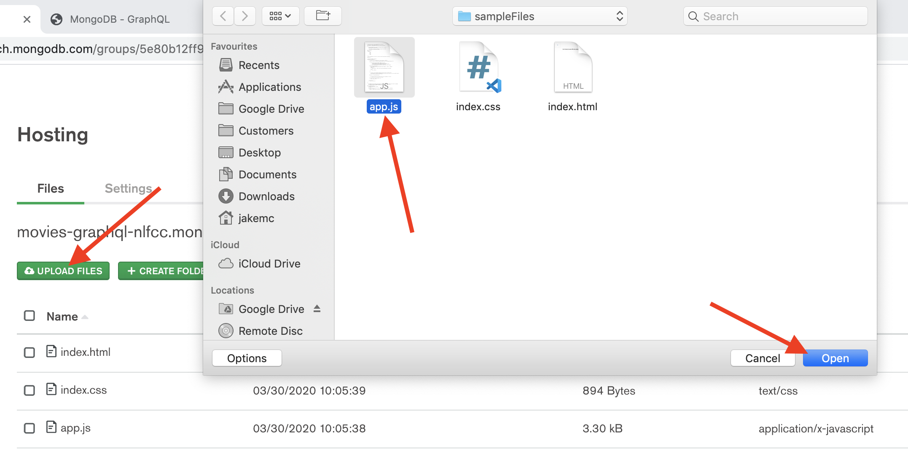
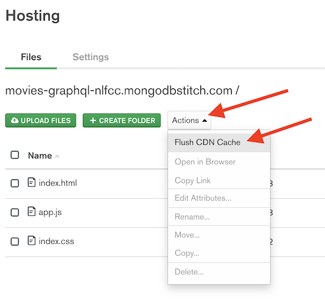
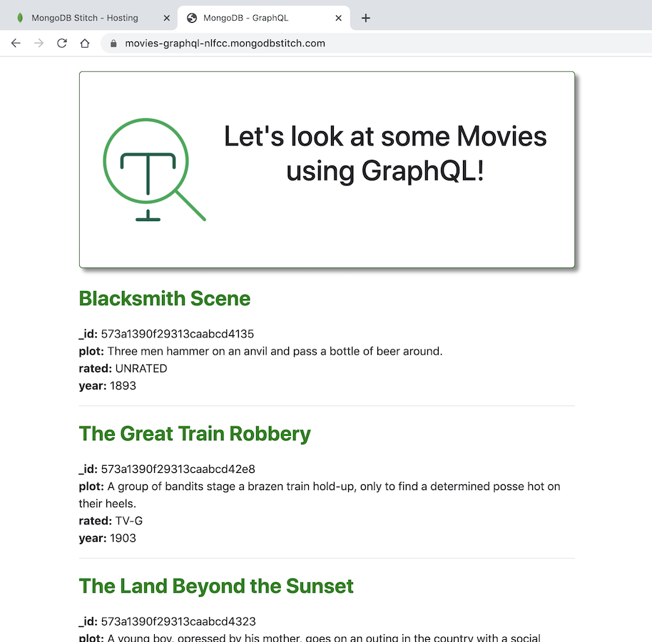

Return to the home of this repository [here](../readme.md).

# Changing the Frontend
When we generated the schema for GraphQL, it automatically included all fields available in the underlying dataset stored in MongoDB. The fields being shown on your webpage are controlled by the fields which are being queried in the JavaScript `app.js` file. 

Firstly, it's worth noting that the app is automatically configured to display on screen any field returned in the API response, as you can see in this section of the code;
```javascript
// For all other fields in the object, add them to htmlStr with the field name in bold, and the field value in plain text
for (field in movie) {
    htmlStr += `<b>${field}:</b> ${movie[field]} <br />`
}
```
This means we just need to update the GraphQL query to add any additional fields. So to add the `rated` field, we just need to add it to the GraphQL query defined in the beginning of `app.js`.

Open up your `app.js` file on your computer and update the GraphQL query to include the rated field like this:
```graphql
query {
    movies {
        _id
        title
        year
        plot
        rated
    }
}
```
Once that's done, you just need to upload the `app.js` file to Realm again. You can do this by either dragging and dropping it, or by selecting "Upload Files". 

***Note:** You will need to accept a dialog about overwriting the file as you are replacing the one you uploaded previously.*
> 

Click `Review & Deploy Changes` then click `Deploy` in order to deploy the changes you've made.
> 

We need to make sure that the new files are propagated through the Content Delivery Network, so make sure to click `Flush Delivery CDN` (you should do this whenever you update files and want them to immediately be updated for downstream users).
> 

You're app should now be updated, go refresh the page you opened earlier to see the changes. You should now see a page that looks a bit like this:
> 

---
**Congratulations** - you're now displaying a new piece of data on your website while only changing a single line of code and having no dependency on a back-end API development team! 

Return back to the [home page](../readme.md) to finish the lab.
